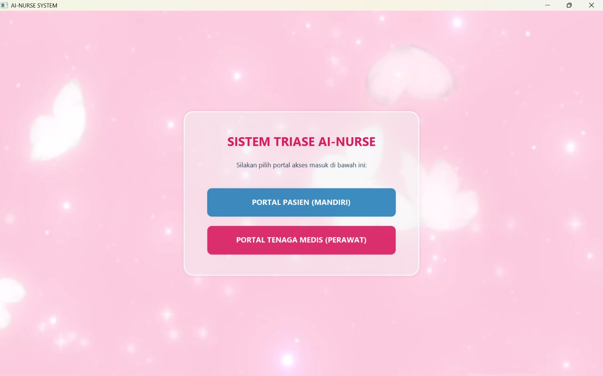
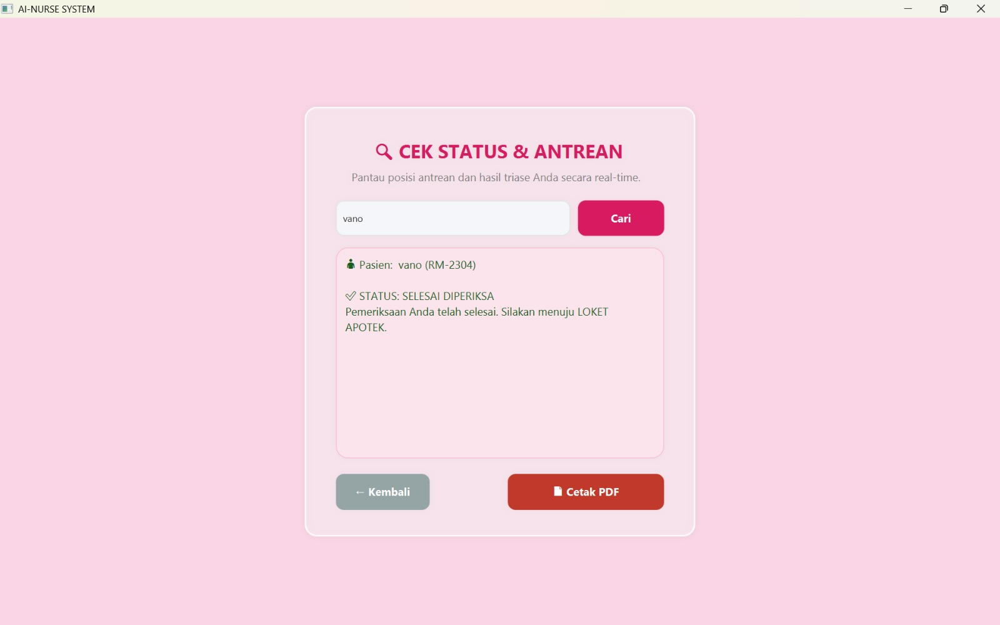
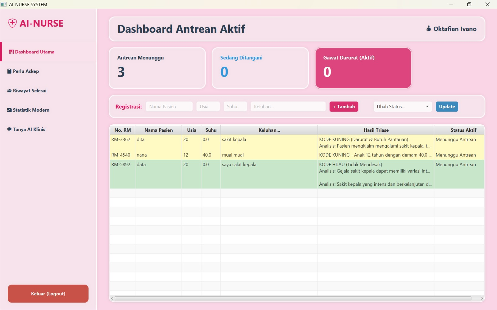
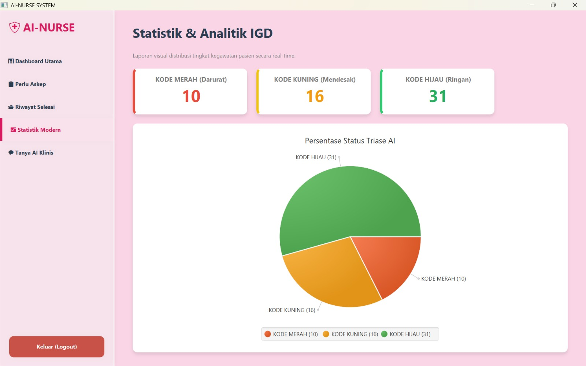

# 🩺 AI-NURSE — Smart Triage & Nursing Care System

> A desktop-based medical application integrating AI-powered emergency triage, JavaFX interface, and Indonesia's official nursing diagnosis standards (SDKI & SIKI).


---

## ✨ Key Features

- **🤖 AI-Powered Emergency Triage**: Automatically classifies patient urgency into Red, Yellow, or Green status using LLM (`llama-3.3-70b-versatile`).
- **👥 Dual Point-of-View (POV)**: Separated workflows and UI for Patient registration and Nurse management dashboard.
- **📚 Integrated SDKI & SIKI**: Standardized medical logging aligned with Indonesian Nursing Care Standards.
- **💬 AI Clinical Assistant**: Real-time clinical query assistance for nurses in emergency rooms.

---

## 🛠️ Tech Stack

| Component | Technology / Library |
| :--- | :--- |
| **Language** | Java 21 |
| **GUI Framework**| JavaFX |
| **Database** | MySQL (Laragon / Localhost) |
| **AI Integration**| Groq Cloud API (`llama-3.3-70b-versatile`) |
| **JSON Parser** | `org.json` |

---

## 🚀 Quick Start & Installation

1. **Clone the Repository**
   ```bash
   git clone [https://github.com/USERNAME_LU/AI-NURSE-APK.git](https://github.com/USERNAME_LU/AI-NURSE-APK.git)





